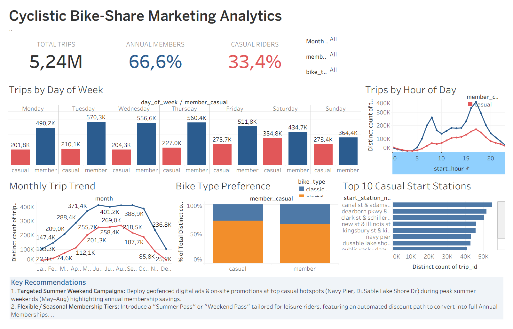

# Cyclistic Bike-Share Marketing Analytics: Analyzing Rider Behavior to Increase Annual Memberships

---
## Project Overview
### Scenario

You are a junior data analyst working on the marketing analyst team at Cyclistic, a bike-share company in Chicago. The director of marketing believes the company’s future success depends on maximizing the number of annual memberships. Therefore, your team wants to understand how casual riders and annual members use Cyclistic bikes differently. From these insights, your team will design a new marketing strategy to convert casual riders into annual members. But first, Cyclistic executives must approve your recommendations, so they must be backed up with compeling data insights and professional data visualizations. 

### Teams

| Teams | Description |
| :--- | :---|
| **Cyclistic** | A bike-share program that features more than 5,800 bicycles and 600 docking stations. |
| **Lily Moreno** | The director of marketing and my manager. Moreno is responsible for the development of campaigns and initiatives to promote the bike-share program. |
| **Cyclistic marketing analytics team** | A team of data analysts who are responsible for colecting, analyzing, and reporting data that helps guide Cyclistic marketing strategy. (My team) |
| **Cyclistic executive team** | The notoriously detail-oriented executive team will decide whether to approve the recommended marketing program. |

<!-- ### Project Duration
The project was implemented from **14 July 2026** to **20 July 2026**.  
The project was completed within **7 days**. -->

---

 
<h3 align="center"> This project still in progress. </h3>

  

  

 

## 📌 Executive Summary
Cyclistic is a bike-share program in Chicago featuring over 5,800 bicycles and 600 docking stations. This project analyzes **5.24+ million ride records** spanning from **July 2025 to June 2026** to understand how **Annual Members** and **Casual Riders** use bikes differently. The ultimate business goal is to design data-driven marketing strategies to convert high-value Casual Riders into Annual Members.

## 📊 Interactive Dashboard Showcase

### 1. Full Dashboard Overview

### 2. Interactive Filtering Demo

> 💡 **Note for Reviewers:** You can download the full Tableau Packaged Workbook file [`Visualisasi.twbx`](dashboard/Visualisasi.twbx) from this repository to explore all calculated fields and interactive elements natively in Tableau Reader or Tableau Desktop.

---
---

## 🛠️ Tech Stack & Methods
* **Data Processing & Cleaning:** Python (`Pandas`, `NumPy`)
* **Spatial Imputation (Machine Learning):** Scikit-Learn (`BallTree` with Haversine distance)
* **Statistical Filtering:** Interquartile Range (IQR) for ride length outlier detection
* **Data Visualization:** Tableau Public

---

## 📊 Key Findings & Insights

### 1. User Volume & Duration Trade-off
* **Annual Members** dominate overall usage, accounting for **66.6% (3.49M trips)** of total rides.
* **Casual Riders** account for **33.4% (1.75M trips)**, but spend **~16.6% longer duration** per ride (12.29 min avg) compared to Members (10.54 min avg).

### 2. Behavioral Patterns (Commuters vs. Leisure)
* **Peak Days:** Members peak during weekdays (**Tuesday - Thursday**), whereas Casual rides surge by **+75% on weekends** (peak on Saturday with 354.8K trips).
* **Peak Hours:** Members exhibit a classic **bimodal commuter pattern** peaking at **08:00 AM** and **05:00 PM**. Casual riders display a smooth **unimodal trend** peaking between **12:00 PM – 05:00 PM**.

### 3. Seasonality & Fleet Preferences
* **Seasonality:** Casual rides are extremely weather-sensitive, plummeting by **-91.7%** during winter (Jan 2026) compared to peak summer (July/August 2025).
* **E-Bike Demand:** Casual riders show a stronger preference for **Electric Bikes (~72.5%)** over Classic Bikes.
* **Hotspots:** Casual trips are heavily concentrated in tourist and coastal areas, with **Navy Pier** and **DuSable Lake Shore Drive** being the top departure stations.

---

## 💡 Strategic Recommendations (Act Stage)

1. **Targeted Summer Weekend Campaigns:**
   * Deploy geofenced digital advertisements and physical promotional booths at top Casual hotspots (**Navy Pier**, **DuSable Lake Shore Drive**) during peak summer weekends (**May – August**), emphasizing the cost savings of an annual membership.

2. **Flexible / Seasonal Membership Tiers:**
   * Introduce a **"Summer Pass"** or **"Weekend Pass"** tailored for leisure riders, featuring an automated upgrade path to a full Annual Membership.

3. **E-Bike Loyalty Incentives:**
   * Capitalize on the high casual preference for e-bikes (~72.5%) by offering Annual Members waived e-bike unlock fees and discounted per-minute rates.

---

## ⚙️ How to Reproduce
1. Clone this repository: `git clone https://github.com/username/repository-name.git`
2. Run the data preparation script: `jupyter notebook prepare.ipynb`
3. Run the ML imputation and cleaning pipeline: `jupyter notebook process.ipynb`
4. Load the generated `bike_trip_data_clean(July 2025-June 2026).csv` into Tableau.

---
